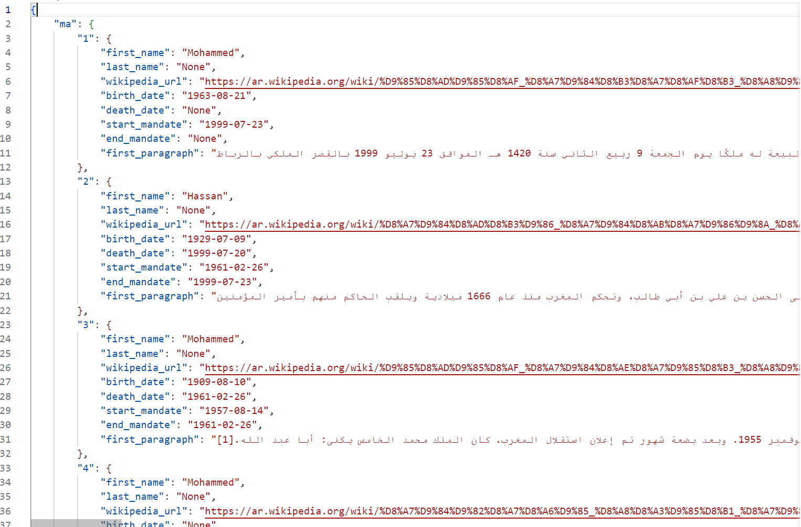

# Wikipedia Scraper

This is a scraper which will query the [Country Leaders API](https://country-leaders.onrender.com/docs "Country Leaders API Documentation"), to obtain a list of countries and their political leaders, eventually outputting their details as well as the first pargraph of their Wikipedia entry as a JSON file.

## In-Depth Description

Using the `requests` Python package, the Wikipedia Scraper queries the [Country Leaders API](https://country-leaders.onrender.com/docs "Country Leaders API Documentation") to get:
 1. A cookie
 2. The list of countries supported by the API, which are:
    * Morocco
    * United States
    * France
    * Belgium
    * Russia
 3. The details of various leaders for each country (if applicable, else `None`), which are:
    * First Name
    * Last Name 
    * Wikipedia URL
    * Birth Date
    * Death Date
    * Place of Birth
    * Start of Mandate
    * End of Mandate

Using `requests` and the **Wikipedia URL** of a specific leader, the content of their wikipedia page is parsed using the `BeautifulSoup` Python package, and the first paragraph is retrieved.

The output is stored as a **JSON file** with the name `leaders_data.json`.


## Dependencies

* Python 3.12.1
* requests 2.31.0
* beautifulsoup4 4.12.3

## Installation

1. Clone this repository to your local machine:

```cmd
git clone https://github.com/jduffy93/wikipedia-scraper.git
```
2. Go to the **wikipedia-scraper** directory:

```cmd
cd directory/wikipedia-scraper
```

3. Install the required packages:

```cmd
pip install -r requirements.txt
```

## Running wikipedia-scraper

Make sure you are in the correct directory (/wikipedia-scraper), if not go to the directory:

 ```cmd
 cd directory/wikipedia-scraper
 ```

Run wikipedia-scraper from main:

```cmd
python main.py
```

## Output

Output preview:




## Roadmap

* Clean paragraph texts to remove pronunciation guides
* Implement sessions() object
* Implement threads to speed up processing time
